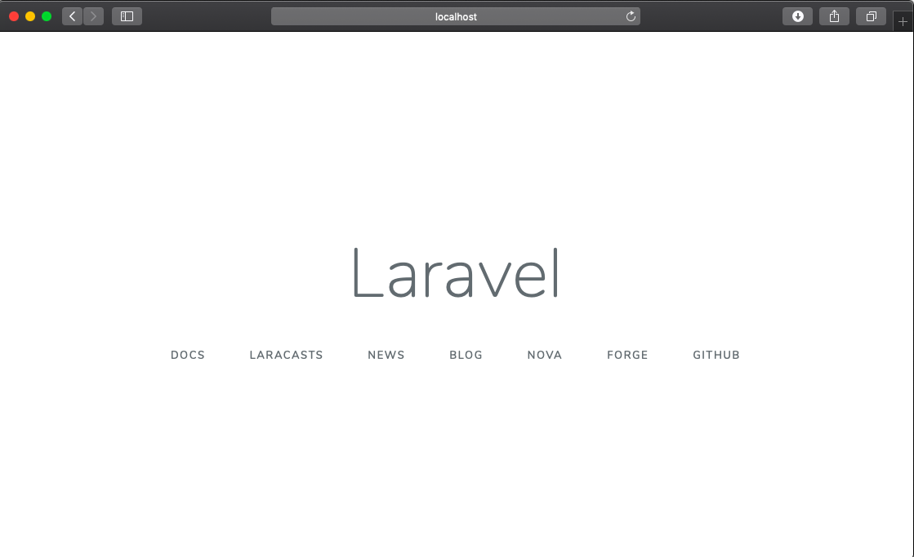

# LaravelPractice
My Laravel Practice Environment

refs   
https://aprico-media.com/posts/2375  
https://qiita.com/A-Kira/items/1c55ef689c0f91420e81  


## Environment
- macOS Mojave 10.14.4
    - Visual Studio Code 1.32.3
- Docker version 18.09.2, build 6247962 (installed)
- docker-compose version 1.23.2, build 1110ad01 (installed)

## Prerequirements
- Install docker 
    - `brew install docker`
- Install docker-compose
    - `brew install docker-compose`
- Start docker daemon
    - Double-click `Docker.app`
        - Grant access privillege  # only 1 time

## Initialize
```
cd /path/to/LaravelPractice

# docker start
docker-compose up -d

# Into php container
docker-compose exec php bash

# Initialize Laravel Project 
laravel new
```

## Terminate 
```
# docker stop
docker-compose stop

(Quit Docker Desktop)
```

## Resume 
```
(Start docker daemon : Double-click `Docker.app`)

cd /path/to/LaravelPractice

docker-compose up &
```

## Destroy
```
# docker-compose down
# docker system prune
```


## Tips 
```
# Into db container
docker exec -it db-host bash

# confirm Laravel version
php artisan --version
Laravel Framework 5.8.7

# rebuild autoload
composer dump-autoload
```

## Result (Sample screen)
